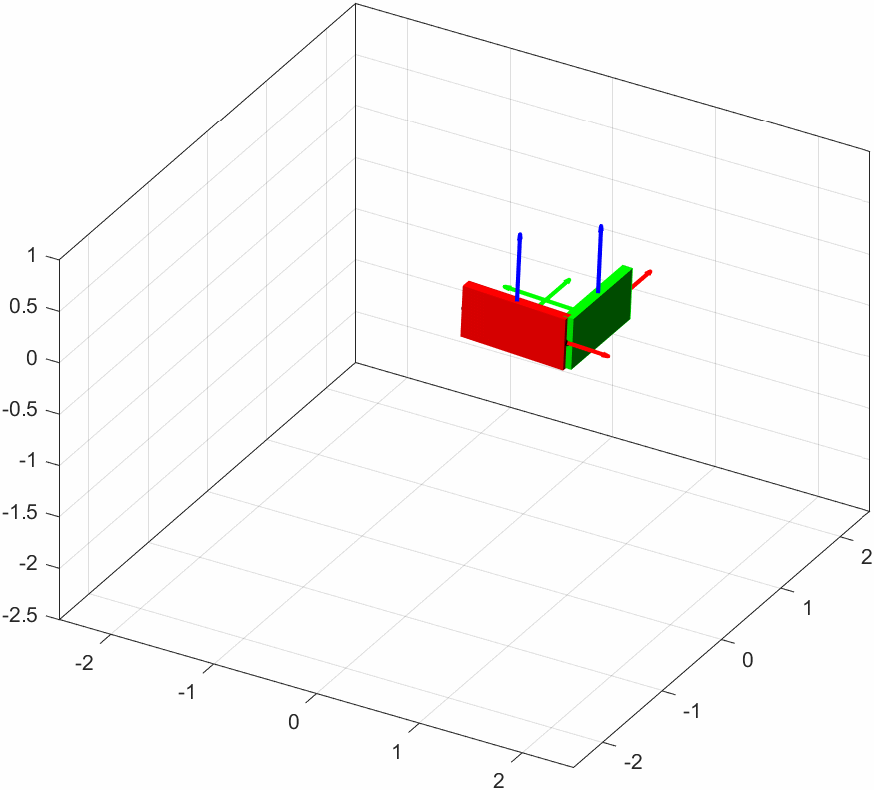

# rbsim
Rigid body simulation made simple.

This is more like a proof-of-concept rather than a ready-to-use library. The rigid body modeling is based on [1], while the constraints are implemented according to the extended position-based dynamics method [2].

## References
[1] Baraff, David. *Physically based modeling: Rigid body simulation*. Siggraph Course Notes, Acm Siggraph 2.1 (2001): 2-1.\
[2] Müller, Matthias, et al. *Detailed rigid body simulation with extended position based dynamics*. Computer Graphics Forum. Vol. 39. No. 8. 2020.
